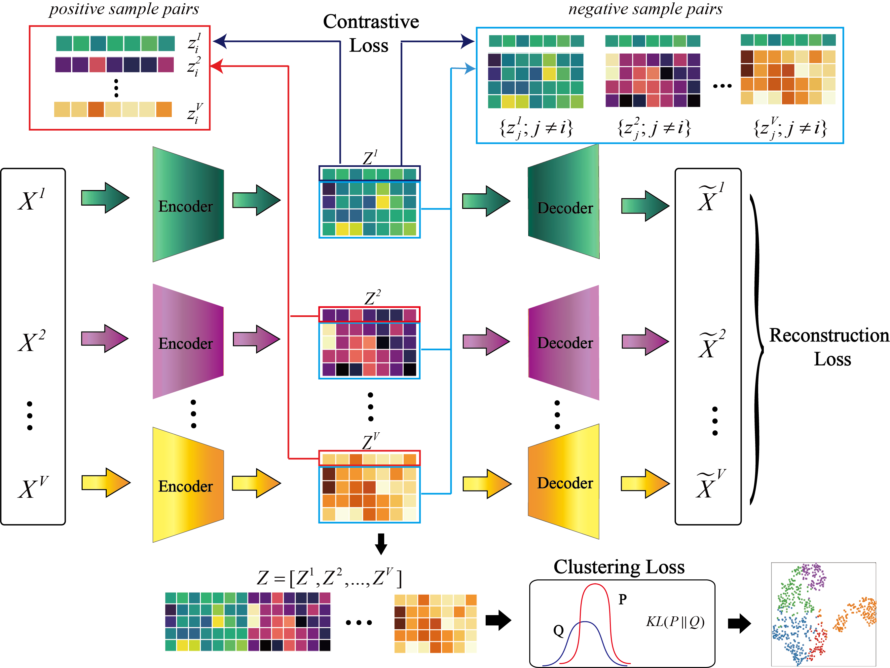

# DMCL

**Program Description**

DMCL is a deep multi-view contrastive learning framework for cancer subtype identification based on multi-omics cancer datasets. The file descriptions are as follows:
    
    
    processDatasets.py: File for data import and data normalization
    pretrainModel.py: A pre_training file for the model
    networkModels.py: The architecture designed in the paper
    modelLoss.py: The losses in architecture
    utils.py: The file for saving model
    DMCL.py: The main file for execution
    
**DMCL Model**

<div align=center></div>

**Requirements**

    >= Python 3.7.9
    >= Pytorch 1.8.1+cu101

**Usage**

   To execute our algorithm, please load the python file: DMCL.py into your PyCharm/Python IDE and click the 'run' button. Users can also execute the program in command-line mode, the specific command is as follows:```python DMCL.py```
   
   All datasets can be viewed and downloaded from this website: https://github.com/alcs417/CGGA/tree/main/cancer_datasets  

**Input and Output Directories**

   The datasets used by the program are in the ```data``` folder. The output files are under the ```result``` folder and separated by the name of the dataset. i.e the results of the liver are in ```result/liver/```. 
   
**Contact**

   For any questions regarding our work, please feel free to contact us：cwlczt@163.com

